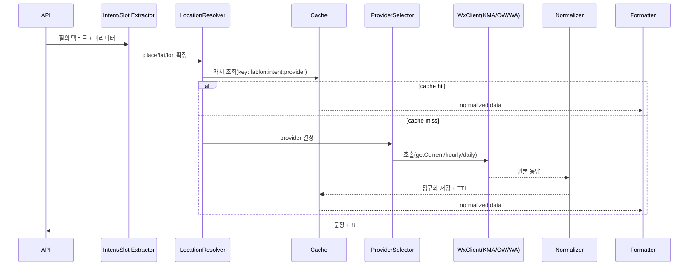

# 위치 기반 날씨 에이전트 – Java 스펙 문서

> Target: 로컬 LLM + Java(Spring Boot) + LangChain4j 기반 / 위치정보(주소·좌표)를 받아 현재/시간별/일별 예보 제공

---

## 1. 목표 & 비범위(Non-goals)
**목표**
- 사용자의 위치(명시적 주소 또는 좌표)를 받아 **현재/시간별/일별** 날씨를 반환
- 한국(기상청 KMA) + 글로벌(OpenWeather 또는 WeatherAPI) **멀티 프로바이더** 지원 및 Fallback
- **캐시/리트라이/표준화**로 안정적 응답 제공
- 대화형 흐름(맥락 유지)과 REST API 제공(외부 클라이언트 연동)

**비범위**
- 실시간 푸시 알림/스케줄러(옵션 섹션에 제안)
- 장기 예보(7일 이상), 기상 재분석 데이터

---

## 2. 아키텍처 개요
- 프레임워크: **Spring Boot 3.x**, Java 21
- LLM: **langchain4j** (로컬 LLM 또는 OpenAI 호환 엔드포인트와 연결)
- 오케스트레이션: 간단한 **상태 머신(Orchestrator)** + 체인(파이프라인) 패턴
- 캐시: **Caffeine** (in-memory, TTL)
- HTTP: Spring WebClient
- 구성(Secrets): Spring Config + `.env`/환경변수
- 빌드: Gradle 또는 Maven

```mermaid
flowchart TD
    U[사용자/클라이언트] --> API[REST API / Chat Endpoint]
    API --> INTENT[Intents & Slot Extractor (LLM)]
    INTENT --> LOC[Location Resolver]
    LOC --> CACHE{Weather Cache}
    CACHE --hit--> FORMAT[Formatter]
    CACHE --miss--> WX[Weather Provider Selector]
    WX -->|KMA| KMA[KMA Client]
    WX -->|OpenWeather| OW[OpenWeather Client]
    WX -->|WeatherAPI| WA[WeatherAPI Client]
    KMA --> NORM[Normalizer]
    OW --> NORM
    WA --> NORM
    NORM --> CACHE
    CACHE --> FORMAT
    FORMAT --> API
```

---

## 3. 주요 유즈케이스
1) **현재 날씨**: "지금 목동 날씨" / `GET /weather/current?place=서울 목동`
2) **시간별 예보**: "시간별로 6시간" / `GET /weather/hourly?place=부산&hours=6`
3) **일별 예보**: "내일/모레 어때?" / `GET /weather/daily?place=제주&days=3`
4) **좌표 기반**: `GET /weather/current?lat=37.5&lon=127.0`

---

## 4. 패키지 구조
```
com.example.wxagent
 ├─ api               # REST, Chat
 ├─ app               # Orchestrator, Graph-like flows
 ├─ llm               # langchain4j prompts/assistants
 ├─ location          # Geocoding/ReverseGeocoding
 ├─ provider          # KMA, OpenWeather, WeatherAPI 클라이언트
 ├─ model             # DTOs, State, Enums
 ├─ service           # WeatherService, CacheService
 ├─ util              # Timezone, Units, RetryUtils
 └─ config            # Beans, Caffeine, WebClient, Props
```

---

## 5. 도메인 모델 (DTO/State)
```java
// model/WeatherSlots.java
public class WeatherSlots {
  public enum Intent { CURRENT, HOURLY, DAILY, ALERT, COMPARE, UNKNOWN }
  private Intent intent = Intent.UNKNOWN;
  private String placeQuery;     // "서울 목동"
  private Double lat;            // nullable
  private Double lon;            // nullable
  private String date;           // ISO yyyy-MM-dd (옵션)
  private String timeOfDay;      // morning/afternoon/evening/night
  private String unit = "metric"; // metric/imperial
  private String detail = "normal"; // brief/normal/verbose
  private String locale = "ko-KR";
  private String tz = "Asia/Seoul";
  // getters/setters
}

// model/WeatherState.java
public class WeatherState {
  private WeatherSlots slots;
  private Map<String, Object> weatherRaw;   // provider 응답 원본
  private Map<String, Object> weatherNorm;  // 표준화된 응답
  private String error;
  // getters/setters
}

// model/WeatherCurrent.java (예시)
public record WeatherCurrent(
    String time, String condition,
    Double tempC, Double feelsLikeC,
    Double windMps, Integer humidity,
    Double precipMm
) {}

// model/WeatherDaily.java (예시)
public record WeatherDaily(
    String date, String condition,
    Double tminC, Double tmaxC,
    Double rainMm, Integer pop
) {}
```

---

## 6. 인터페이스 설계
```java
// provider/WeatherClient.java
public interface WeatherClient {
  Map<String, Object> getCurrent(double lat, double lon) throws ProviderException;
  Map<String, Object> getHourly(double lat, double lon, int hours) throws ProviderException;
  Map<String, Object> getDaily(double lat, double lon, int days) throws ProviderException;
  String name();
}

// location/GeocodingClient.java
public interface GeocodingClient {
  Optional<GeoPoint> geocode(String query) throws ProviderException;  // "서울 목동" -> lat/lon
  Optional<String> reverse(double lat, double lon) throws ProviderException; // 좌표 -> 주소(표시용)
}

public record GeoPoint(double lat, double lon, String displayName) {}
```

---

## 7. 프로바이더 구현 개요
### 7.1 OpenWeatherClient (권장: 초기 빠른 구현)
- REST: `/weather`, `/forecast`
- 매개변수: `lat, lon, units=metric, lang=kr`
- 응답을 공통 포맷으로 **normalize**

### 7.2 WeatherAPIClient (대안/백업)
- REST: `/current.json`, `/forecast.json?days=3`
- 파싱 필드: `temp_c, feelslike_c, wind_kph→m/s, precip_mm, condition.text, forecastday[]`

### 7.3 KMAClient (한국 정확도↑, 2단계)
- API: 초단기/단기예보, 격자 변환 필요(lat/lon→nx, ny)
- 응답 파싱/단위 변환/필드 매핑

---

## 8. 정규화(표준화) 규약
- 시간대: `slots.tz` 기준(기본 `Asia/Seoul`)
- 온도: °C, 풍속: m/s, 강수량: mm, 강수확률: %
- 공통 구조 예시
```json
{
  "current": { "time":"2025-09-20 14:00", "condition":"맑음", "temp_c":26.3, "feelslike_c":27.1, "wind_mps":2.4, "humidity":52, "precip_mm":0.0 },
  "hourly": [ {"time":"2025-09-20 15:00", "temp_c":26.0, "pop":10, "precip_mm":0.0, "condition":"맑음" } ],
  "daily": [ {"date":"2025-09-21", "tmin_c":19.0, "tmax_c":28.0, "rain_mm":1.2, "pop":30, "condition":"가끔 구름" } ],
  "tz":"Asia/Seoul",
  "place":"서울 양천구 목동"
}
```

---

## 9. 오케스트레이션(체인/상태 머신)


---

## 10. REST API 스펙
### 10.1 공통
- Base: `/api`
- 응답: `application/json; charset=utf-8`
- 에러: RFC7807 `application/problem+json`

### 10.2 엔드포인트
- **GET `/api/weather/current`**
  - Query: `place` OR (`lat`,`lon`), `unit?`, `locale?`
  - 200 응답 예시:
```json
{
  "place":"서울 양천구 목동",
  "current": {"time":"2025-09-20 14:00","condition":"맑음","temp_c":26.3,"feelslike_c":27.1,"wind_mps":2.4,"humidity":52,"precip_mm":0.0}
}
```

- **GET `/api/weather/hourly`**
  - Query: `place` OR (`lat`,`lon`), `hours?=6`, `unit?`

- **GET `/api/weather/daily`**
  - Query: `place` OR (`lat`,`lon`), `days?=3`, `unit?`

- **POST `/api/chat/weather`**
  - Body: `{ "message":"내일 아침 목동 날씨" }`
  - 내부적으로 LLM으로 intent/slot 파싱 후 동일 파이프라인 수행

---

## 11. LLM / LangChain4j 설계
- **프롬프트**: 한국어 우선, 단위/형식 명확 표기(°C, mm, m/s)
- **기능**: Intent 추출(CURRENT/HOURLY/DAILY), 시간 표현(“내일 아침”), 장소 NER
- **가드레일**: 미확인 위치 시 1회만 명확히 요청
- **샘플 시스템 프롬프트**
```
너는 친절한 날씨 비서다. 사용자의 한국어 요청에서 의도(intent)와 슬롯(place/date/time_of_day)을 JSON으로 뽑아라.
응답은 JSON 하나만 출력한다.
```

---

## 12. 캐시 전략
- 라이브러리: **Caffeine**
- 키 포맷: `lat:lon:intent:provider:unit:granularity:date`
- TTL: 10분(기본). 환경변수로 조정 `WX_CACHE_TTL_SECONDS`
- 값: **정규화된 응답**(Map or DTO)

---

## 13. 프로바이더 선택/리트라이
- 우선순위: `KMA > OpenWeather > WeatherAPI`
- 최초 구현은 `OpenWeather` 단일로 시작 → 통합 테스트 통과 후 KMA 추가
- 리트라이: `exponential backoff(100ms, 300ms, 900ms)` 최대 3회
- 타임아웃: 2~5초 (환경변수)

---

## 14. 에러 처리
- `ProviderException` → 502 Bad Gateway
- 위치 미해결 → 400 + "위치정보가 필요합니다"
- 파라미터 오류 → 400 + 문제 상세
- 공통 Problem+JSON 예시:
```json
{
  "type":"about:blank",
  "title":"Bad Request",
  "status":400,
  "detail":"place 또는 lat/lon 중 하나가 필요합니다"
}
```

---

## 15. 설정(환경변수)
- `OPENWEATHER_API_KEY`
- `WEATHERAPI_KEY` (옵션)
- `KMA_API_KEY` (옵션)
- `WX_CACHE_TTL_SECONDS=600`
- `WX_TIMEOUT_MS=3000`
- `WX_DEFAULT_TZ=Asia/Seoul`

---

## 16. 보안/프라이버시
- 좌표/주소 **로그 최소화**(소수점 3자리 반올림)
- IP 기반 위치는 **명시적 동의** 후에만 사용(서버 로그에 저장 금지)
- API 키는 환경변수/Secret Manager로 주입, Git에 커밋 금지

---

## 17. 테스트 전략
- 단위 테스트: JUnit5 + Mockito (정규화 로직, Provider 파서)
- 통합 테스트: Testcontainers(선택), WireMock으로 외부 API 모킹
- 부하 테스트: Gatling/JMeter (p95<300ms 캐시 히트 기준)

---

## 18. 관측성(Observability)
- 로깅: SLF4J + Logback(JSON 로그 선택)
- 메트릭: Micrometer + Prometheus (cache hit/miss, provider RTT, error rate)
- 트레이싱: OpenTelemetry(선택)

---

## 19. 성능 목표
- 캐시 히트 시 p95 < **300ms**
- 콜드(외부호출 1회) p95 < **1500ms**
- QPS 50 기준에서 무중단

---

## 20. 예시 코드 스니펫
```java
// service/WeatherService.java
@Service
public class WeatherService {
  private final GeocodingClient geocoding;
  private final ProviderSelector selector;
  private final CacheService cache;

  public Map<String, Object> current(String place, Double lat, Double lon) {
    GeoPoint p = resolve(place, lat, lon);
    String key = cache.key(p.lat(), p.lon(), "CURRENT");
    return cache.getOrLoad(key, () -> {
      WeatherClient client = selector.pick();
      Map<String, Object> raw = client.getCurrent(p.lat(), p.lon());
      return Normalizers.normalize(raw, client.name(), "CURRENT", ZoneId.of("Asia/Seoul"));
    });
  }
  private GeoPoint resolve(String place, Double lat, Double lon) {
    if (lat != null && lon != null) return new GeoPoint(lat, lon, "");
    return geocoding.geocode(place).orElseThrow(() -> new BadRequestException("위치 미해결"));
  }
}
```

---

## 21. 빌드 & 실행
### Gradle (권장)
```gradle
plugins { id 'java'; id 'org.springframework.boot' version '3.3.0' }
java { toolchain { languageVersion = JavaLanguageVersion.of(21) } }
dependencies {
  implementation 'org.springframework.boot:spring-boot-starter-web'
  implementation 'com.github.ben-manes.caffeine:caffeine:3.1.8'
  implementation 'org.springframework.boot:spring-boot-starter-validation'
  testImplementation 'org.springframework.boot:spring-boot-starter-test'
  // langchain4j (옵션)
  implementation 'dev.langchain4j:langchain4j:0.34.0'
}
```

```bash
export OPENWEATHER_API_KEY=...
./gradlew bootRun
```

---

## 22. 확장 계획(옵션)
- **KMA 정식 연동**: 격자변환 유틸 + 초단기/단기 API 래퍼
- **Air Quality(미세먼지)**: AQI 지표 추가, 활동 팁(세차/세탁/런닝 지수)
- **알림 에이전트**: 아침 7시 우산 필요 시 알림 → Spring Scheduling + 캐시 비교
- **멀티턴 대화**: 대화 컨텍스트에 최근 위치/선호 세팅 저장(사용자 동의 하)

---

## 23. 수용 기준(Acceptance Criteria)
- [ ] `/api/weather/current`에 `place`만 제공해도 200 응답과 표준화 필드 반환
- [ ] 좌표 입력 시 지오코딩 생략, 결과 동일 보장
- [ ] 캐시 TTL 내 반복 호출 시 외부 API 미호출(메트릭으로 검증)
- [ ] 프로바이더 장애(타임아웃) 시 Fallback 동작, 2번째 제공자가 정상 응답
- [ ] 한국어/영어 응답 토글(LLM 또는 포맷터 옵션)

---

## 24. 샘플 응답(요약형)
```json
{
  "summary":"서울 양천구 목동 현재 맑음, 26.3°C(체감 27.1°C), 강수 0mm, 바람 2.4m/s",
  "current": {"time":"2025-09-20 14:00","condition":"맑음","temp_c":26.3,"feelslike_c":27.1,"wind_mps":2.4,"humidity":52,"precip_mm":0.0},
  "next_hours":[{"time":"15:00","temp_c":26.0,"pop":10,"condition":"맑음"}],
  "tips":["자외선 지수 높음: 모자/선크림","세차 지수 양호"]
}
```

---

### 끝.

